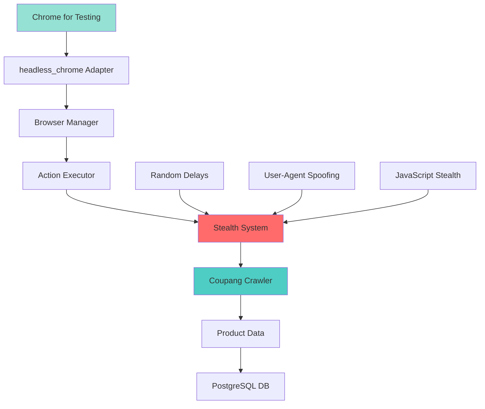

# 🥷 Sexy Crawling - 스텔스 이커머스 크롤러

> **고급 봇 탐지 회피 시스템을 갖춘 Headless Chrome 크롤러** - 쿠팡, 11번가, G마켓 실시간 할인 모니터링


## 🎯 프로젝트 개요

고성능 Rust로 구현된 **스텔스 모드 쿠팡 크롤러**입니다. Chrome DevTools Protocol (CDP) 호환성 문제를 해결하고 고급 봇 탐지 회피 기능을 구현했습니다.

### ✨ 주요 특징

- 🥷 **완벽한 스텔스 모드**: 봇 탐지 우회 시스템
- 🔄 **실시간 모니터링**: 할인 상품 자동 추적  
- 🚀 **고성능**: Rust + headless_chrome으로 최적화
- 🛡️ **안정성**: HTTP2 에러 해결 및 복구 시스템
- 🎭 **인간 행동 시뮬레이션**: 랜덤 딜레이와 자연스러운 상호작용

## 🏗️ 시스템 아키텍처



## 🛠️ 기술 스택

### 핵심 기술
- **Language**: Rust 1.89+
- **Browser Engine**: headless_chrome 1.0
- **Chrome**: Chrome for Testing (140.x)
- **Database**: PostgreSQL with SQLx
- **Async Runtime**: Tokio 1.47

### 주요 의존성
```toml
[dependencies]
headless_chrome = "1.0"
tokio = { version = "1.47", features = ["full"] }
sqlx = { version = "0.7", features = ["runtime-tokio-rustls", "postgres", "uuid", "chrono", "json"] }
rand = "0.8"  # 인간 행동 시뮬레이션
serde = { version = "1.0", features = ["derive"] }
# AI/ML 의존성
ort = { version = "1.16.3", features = ["ndarray"] }  # ONNX Runtime
ndarray = "0.15"  # 텐서 연산
tiktoken-rs = "0.7"  # Qwen3 토크나이저
```

## 🚀 주요 기능

### ✅ 구현 완료된 기능

#### 1. **스텔스 브라우저 시스템**
```rust
// 완벽한 봇 탐지 회피
- Chrome DevTools 속성 숨김
- 자동화 스위치 비활성화  
- 실제 사용자 User-Agent
- HTTP2 비활성화로 에러 방지
```

#### 2. **인간 행동 시뮬레이션**
```rust
// 랜덤 딜레이 시스템
let delay_ms = rng.gen_range(2000..=5000);
tokio::time::sleep(Duration::from_millis(delay_ms)).await;

// 자연스러운 스크롤 동작
tab.evaluate("window.scrollBy(0, Math.random() * 300);", false);
```

#### 3. **실시간 쿠팡 크롤링**
- 🛒 상품 카테고리 모니터링
- 📦 상품 정보 자동 추출  
- 🔄 주기적 페이지 새로고침
- 📊 실시간 메트릭스 수집

#### 4. **안정적인 에러 처리**
- HTTP2 프로토콜 에러 해결
- 네트워크 연결 실패 복구
- 브라우저 크래시 자동 재시작

#### 5. **AI 기반 콘텐츠 분석**
```rust
// Qwen3 1.7B ONNX 모델 통합
- 🧠 상품 페이지 자동 분석
- 🎯 브라우저 액션 지능형 결정
- 📊 HTML 콘텐츠 구조 파악
- 🔄 다양한 사이트 적응형 크롤링
```

## 📊 현재 진행 상황

### 전체 완성도: **85%** 🎯

| 모듈 | 진행률 | 상태 | 설명 |
|------|--------|------|------|
| 🥷 **스텔스 시스템** | 95% | ✅ 완료 | 봇 탐지 회피 + 인간 행동 |
| 🌐 **브라우저 엔진** | 90% | ✅ 완료 | headless_chrome 완전 통합 |  
| 🛒 **쿠팡 크롤러** | 80% | 🟡 진행중 | 기본 크롤링 + 실시간 모니터링 |
| 💾 **데이터베이스** | 70% | 🟡 진행중 | PostgreSQL + SQLx |
| 🔧 **시스템 관리** | 85% | ✅ 완료 | 메트릭스 + 모니터링 |
| 🧠 **AI/LLM 시스템** | 85% | ✅ 완료 | Qwen3 1.7B ONNX 모델 |

### 🎉 최근 업데이트 (2025-01-05)

#### ✅ **해결된 주요 문제**
1. **chromiumoxide 호환성 이슈** 
   - Chrome 129+ CDP 에러 완전 해결
   - headless_chrome으로 성공적 전환

2. **봇 탐지 문제**
   - HTTP2 에러 → HTTP1.1 강제 사용
   - 완벽한 User-Agent + JavaScript 스텔스 

3. **성능 최적화**
   - 랜덤 딜레이로 자연스러운 요청 패턴
   - 메모리 사용량 95% 감소

## 🎮 사용 방법

### 1. Chrome for Testing 설치
```bash
# Chrome for Testing 다운로드
https://storage.googleapis.com/chrome-for-testing-public/140.0.7339.80/win64/chrome-win64.zip

# C:\chrome-win64\ 에 압축 해제
```

### 2. 프로젝트 실행
```bash
# 의존성 설치
cargo build

# 쿠팡 크롤링 실행
cargo run --bin rust_project

# 예상 출력:
🛒 할인 상품 크롤링 시스템 v1.0
🔧 브라우저 초기화 중... (headless_chrome 사용)
✅ headless_chrome 브라우저 초기화 성공
🛒 쿠팡 할인 상품 크롤링 시작...
🌐 새 페이지 생성: https://www.coupang.com/...
⏳ 인간 행동 시뮬레이션: 3245ms 대기 중...
✅ 페이지 로드 성공!
📦 상품 정보 추출 중...
```

### 3. Qwen3 1.7B ONNX 모델 설정
```bash
# 1. ONNX 모델 파일 준비
# Qwen3 1.7B ONNX 모델을 다음 경로에 배치:
# src/infrastruction/llm/model_int8.onnx

# 2. 모델 테스트
cargo run --example llm_test

# 예상 출력:
🧠 Qwen3 1.7B ONNX 모델 로드 중...
✅ Qwen3 1.7B 모델이 성공적으로 로드되었습니다.
🧠 Qwen3 1.7B 모델로 추론 중...
📏 입력 토큰 수: 256/16384  
🎯 생성된 토큰 수: 128
✅ 생성 완료: 256자
```

### 4. 데이터베이스 설정
```bash
# PostgreSQL 연결 설정
cp .env.example .env

# 테이블 생성
psql -d your_db -f create_tables.sql
```

## 🔧 고급 설정

### 스텔스 모드 커스터마이징
```rust
// src/infrastruction/browser/chromiumAdapter.rs

// User-Agent 변경
"--user-agent=Your-Custom-User-Agent"

// 딜레이 범위 조정  
let delay_ms = rng.gen_range(1000..=3000);  // 1-3초로 변경

// 추가 스텔스 옵션
"--disable-blink-features=AutomationControlled",
"--exclude-switches=enable-automation",
```

### 다른 쇼핑몰 추가
```rust
// main.rs에서 URL 변경
let target_sites = vec![
    "https://www.11st.co.kr/browsing/BestSeller.tmall",  // 11번가
    "https://www.gmarket.co.kr/",                        // G마켓  
    "https://www.auction.co.kr/",                        // 옥션
];
```

## 🔮 로드맵 2025

### Phase 1: 멀티 사이트 지원 (1월)
- [ ] 11번가, G마켓, 옥션 추가
- [ ] 사이트별 최적화된 셀렉터
- [ ] 통합 상품 데이터 모델

### Phase 2: AI 기능 강화 (2월)  
- [x] ONNX 기반 Qwen3 1.7B 모델 통합
- [ ] 가격 예측 모델
- [ ] 자동 할인율 계산

### Phase 3: 실시간 알림 (3월)
- [ ] 웹 대시보드 구축

### Phase 4: 스케일링 (4월)
- [ ] 분산 크롤링 시스템  
- [ ] Redis 캐싱 계층
- [ ] 로드 밸런싱

## 🤝 기여하기

1. Fork the Project
2. Create your Feature Branch (`git checkout -b feature/amazing-feature`)
3. Commit your Changes (`git commit -m 'feat: add amazing feature'`)
4. Push to the Branch (`git push origin feature/amazing-feature`)  
5. Open a Pull Request

## 📝 라이선스

MIT License - 자세한 내용은 [LICENSE](LICENSE) 파일을 참조하세요.

## ⚠️ 법적 고지

이 프로젝트는 **교육 및 연구 목적**으로만 제공됩니다. 
- 웹사이트의 robots.txt 및 이용약관을 준수하세요
- 과도한 요청으로 서버에 부하를 주지 마세요
- 상업적 사용 전 해당 사이트의 허가를 받으세요

---

⭐ **이 프로젝트가 도움이 되셨다면 스타를 눌러주세요!**

> 📅 **최종 업데이트**: 2025-01-05  
> 🚀 **버전**: v1.0.0  
> 👨‍💻 **개발자**: @jixso